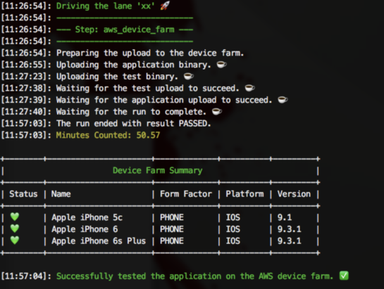
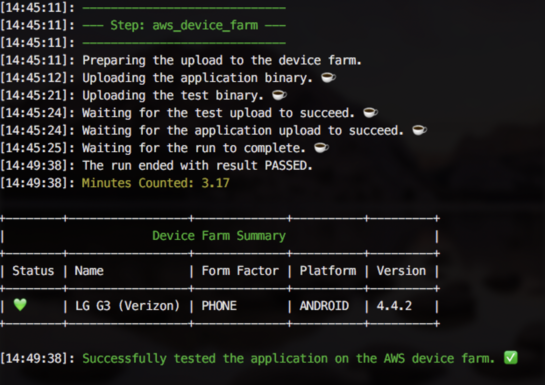
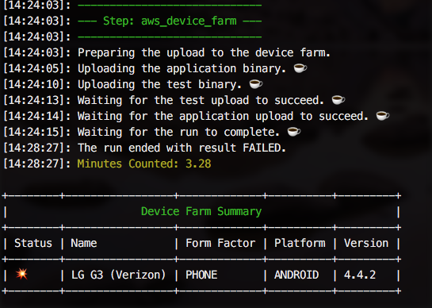

# AWS Device Farm Plugin for Fastlane

[](https://rubygems.org/gems/fastlane-plugin-sharethemeal)


## About
> This Plugin Allows XCUITests and android Instrumentation tests run on AWS device Farm


| iOS | Android | Fail |
|----------|-------------|-------------|
|  |  |  |


## Setup
### Add Plugin
```
fastlane add_plugin aws_device_farm
```

### Create Device Pools
Open your AWS dashboard and under `AWS-Device Farm` - configure your Device Pools.
Select the devices you want to run the tests on.


### Create a project on AWS
in this example we called this `fastlane`

## Example iOS

```ruby
lane :aws_device_run_ios do
  ENV['AWS_ACCESS_KEY_ID']     = 'xxxxx'
  ENV['AWS_SECRET_ACCESS_KEY'] = 'xxxxx'
  ENV['AWS_REGION']            = 'us-west-2'
  
  #Build For Testing
  xcodebuild(
    scheme: 'UITests',
    destination: 'generic/platform=iOS',
    configuration: 'Development',
    derivedDataPath: 'aws',
    xcargs: "GCC_PREPROCESSOR_DEFINITIONS='AWS_UI_TEST' ENABLE_BITCODE=NO CODE_SIGN_IDENTITY="" CODE_SIGNING_REQUIRED=NO build-for-testing"
  )
  # Transform .app into AWS compatible IPA
  aws_device_farm_package(
    derrived_data_path: "aws"
  )
  # RUN tests on AWS Device Farm
  aws_device_farm
end
```


## Example Android

```ruby
lane :aws_device_run_android do
  ENV['AWS_ACCESS_KEY_ID']     = 'xxxxx'
  ENV['AWS_SECRET_ACCESS_KEY'] = 'xxxxx'
  ENV['AWS_REGION']            = 'us-west-2'

  #Build Debug App + Instrumentation Apk
  gradle(task: 'assembleDebug')
  gradle(task: 'assembleAndroidTest')

  # RUN tests on AWS Device Farm
  aws_device_farm(
    binary_path:         'app/build/outputs/apk/app-debug.apk',
    test_binary_path:    'app/build/outputs/apk/app-debug-androidTest-unaligned.apk'
  )
end
```

## Options

 * **aws_device_farm**
 
|  Option |  Default  |  Description |  Type |
|---|---|---|---|
|  name |  fastlane  |  AWS Device Farm Project Name |  String |
|  binary_path |    |  Path to App Binary |  String |
|  test_binary_path |    |  Path to App Binary |  String |
|  device_pool | IOS | AWS Device Farm Device Pool | String |
|  wait_for_completion | true | Wait for Test-Run to be completed | Boolean |


* **aws_device_farm_package**

|  Option |  Default  |  Description |  Type |
|---|---|---|---|
|  derrived_data_path |    |  Derrived Data Path, containing a `build-for-testing` derrived-data folder |  String |


## Credit
it is based on a custom action by @icapps (https://github.com/icapps/fastlane-configuration)
added the following:
  * iOS Support for XCUITests
  * support current `fastlane` version
  * improve output
  * make it available as a `fastlane` plugin
  

## Troubleshooting

If you have trouble using plugins, check out the [Plugins Troubleshooting](https://github.com/fastlane/fastlane/blob/master/fastlane/docs/PluginsTroubleshooting.md) doc in the main `fastlane` repo.


## About `fastlane`

`fastlane` is the easiest way to automate building and releasing your iOS and Android apps. To learn more, check out [fastlane.tools](https://fastlane.tools).
